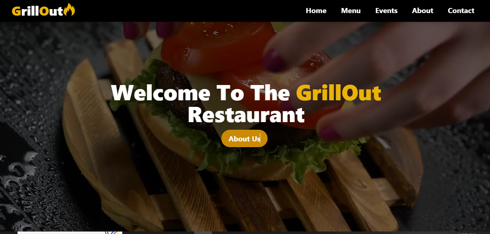

# 🔥 GrillOut – Modern Restaurant Website

GrillOut is a sleek, modern, and fully responsive restaurant website built with Next.js. It features animated sections, a beautiful UI, and seamless user interaction. Customers can directly place orders via WhatsApp, making it ideal for small to mid-sized food businesses.

---

## 🚀 Features

- ✅ Built with **Next.js**
- 💡 Fully **Responsive Design**
- 🎨 Smooth **Animations** for enhanced UX
- 📱 **WhatsApp Ordering Integration**
- 📄 Pages: Home | Menu | About | Events | Contact
- 🌐 SEO-friendly structure

---

## 📸 Preview


---

## 🛠️ Tech Stack

- **Framework:** Next.js
- **UI Library:** React
- **Styling:** Tailwind CSS
- **Animations:** Framer Motion (if used)
- **Deployment:** Vercel

---

## 📦 Getting Started (Development)

To run this project locally:

```bash
# Clone the repo
git clone https://github.com/UmarKhan-codeer/grillout.git

# Navigate to the project directory
cd grillout

# Install dependencies
npm install

# Start the development server
npm run dev
```

Open your browser at: [http://localhost:3000](http://localhost:3000)

---

## 📤 Deployment

This project is live and hosted on Vercel.

- 🔗 **Live Demo:**  [https://grillout-resturant-website-t71v.vercel.app/](https://grillout-resturant-website-t71v.vercel.app/)
- 🔗 **Repository:** [https://github.com/UmarKhan-codeer/grillout](https://github.com/UmarKhan-codeer/grillout)

---

## 🙌 Author

**Umer Javed**

- 🔗 [LinkedIn](https://www.linkedin.com/in/umerrjaved/)
- 💻 [GitHub](https://github.com/UmarKhan-codeer)
- 🌐 [Portfolio](https://portfolio-umer-pro.vercel.app/)

---

## 📃 License

This project is open-source and available under the MIT License.
